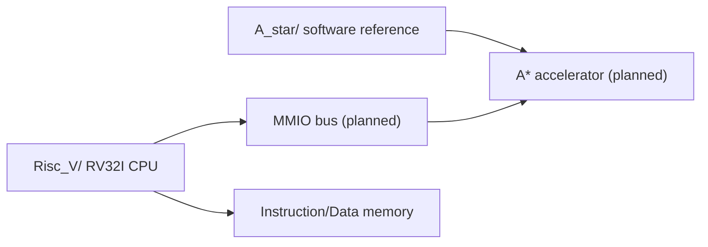

# RV32I A* Accelerator

FPGA SoC project with two main tracks:

- `Risc_V/`: RV32I CPU design and simulation bring-up
- `A_star/`: A* pathfinding reference model for the future accelerator

The current focus is building and verifying the RV32I CPU pipeline first, then connecting an A* pathfinding accelerator through an MMIO-style interface.

## Project Map



## Folders

| Folder | What is inside |
|---|---|
| `Risc_V/` | My RV32I CPU implementation, pipeline testbenches, reports |
| `A_star/` | My A* software reference model and source notes |

Everything else from the earlier mixed layout was removed or moved into these two project areas so the repository reads cleanly from the top level.

## Current RISC-V Status

Active design:

```text
Risc_V/6_24_25/
```

Verified so far:

- 5-stage pipeline skeleton: IF / ID / EX / MEM / WB
- Instruction memory loaded from `program.hex`
- Register file with x0 fixed to zero
- Immediate generation
- Main control and ALU control
- ALU subset and branch comparison
- Branch target address calculation
- EX-stage branch decision
- IF/ID and ID/EX flush on branch taken
- Questa branch taken/not-taken testbench

Latest passing test:

```text
PASS: branch taken/not-taken flush test without RAW hazards
```

Run it in Questa:

```tcl
cd D:/Programs/vscode_workspace/Soc_Project/Risc_V/6_24_25
vlib work
vlog -sv *.v
vsim tb_branch_nohazard
run -all
```

## Current A* Status

Active reference:

```text
A_star/astar.c
```

The A* reference is written as a hardware-friendly C model:

- static arrays
- 2D grid
- 4-direction movement
- Manhattan heuristic
- no malloc
- no recursion
- no floating point
- explicit `find_min_node()` boundary for a future accelerator

Algorithm references and attribution are documented in:

```text
A_star/SOURCES.md
```

## Reports

Reports are now under:

```text
Risc_V/reports/
```

Current portfolio report:

- `Risc_V/reports/26_06_25/2026-06-25.md`
- `Risc_V/reports/26_06_25/2026-06-25_RV32I_pipeline_branch_flush.docx`
- `Risc_V/reports/26_06_25/2026-06-25_RV32I_pipeline_branch_flush.pdf`

## Next Milestones

1. Add `LW/SW` data memory verification.
2. Add forwarding logic for ALU-ALU RAW hazards.
3. Add stall logic for load-use hazards.
4. Complete JAL/JALR datapath behavior.
5. Define the MMIO register map for the A* accelerator.
6. Connect the A* accelerator prototype to the RV32I system.

