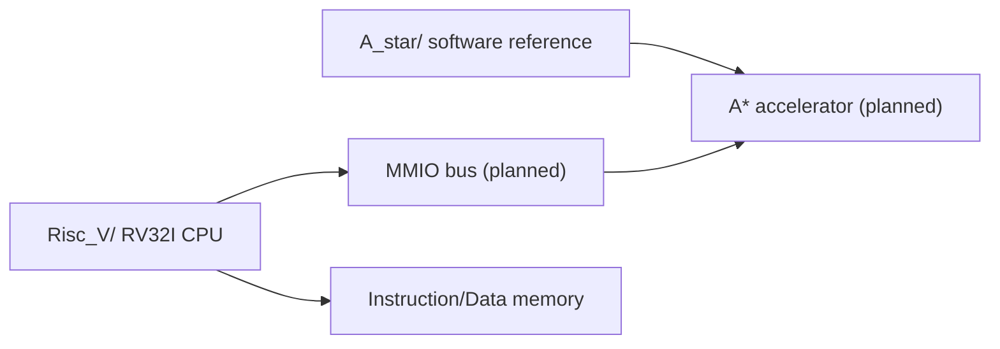

# RV32I A* Accelerator

FPGA SoC project with two main tracks:

- `Risc_V/`: RV32I CPU design and simulation bring-up
- `A_star/`: A* pathfinding reference model for the future accelerator

The current focus is building and verifying the RV32I CPU pipeline first, then connecting an A* pathfinding accelerator through an MMIO-style interface.

## Project Map



## Folders

| Folder | What is inside |
|---|---|
| `Risc_V/` | My RV32I CPU implementation, pipeline testbenches, reports |
| `A_star/` | My A* software reference model and source notes |

Everything else from the earlier mixed layout was removed or moved into these two project areas so the repository reads cleanly from the top level.

## Current RISC-V Status

Active design:

```text
Risc_V/code_6_27-7_01/
```

Verified so far:

- 5-stage pipeline: IF / ID / EX / MEM / WB
- Instruction memory loaded from hex test programs
- Register file with x0 fixed to zero
- Immediate generation for I/S/B/U/J formats
- Main control, ALU control, and writeback result selection
- ALU subset: ADD, SUB, AND, OR, XOR, SLL and immediate variants
- Load/store data memory path: LW, SW
- LUI writeback path
- JAL/JALR jump target and PC+4 link writeback
- ID-stage branch decision and IF/ID flush
- EX forwarding and load-use stall handling
- Final integrated Questa testbench

Latest passing test:

```text
PASS: final integrated pipeline proof - ALU, LUI, jumps, branches, load-use, forwarding, LW/SW
```

Run it in Questa:

```tcl
cd D:/Programs/vscode_workspace/Soc_Project
vlib work
vlog Risc_V/code_6_27-7_01/*.v
vsim work.tb_final_pipeline_proof
run -all
```

## Current A* Status

Active reference:

```text
A_star/astar.c
```

The A* reference is written as a hardware-friendly C model:

- static arrays
- 2D grid
- 4-direction movement
- Manhattan heuristic
- no malloc
- no recursion
- no floating point
- explicit `find_min_node()` boundary for a future accelerator

Algorithm references and attribution are documented in:

```text
A_star/SOURCES.md
```

## Reports

Reports are now under:

```text
Risc_V/reports/
```

Current portfolio report:

- `Risc_V/reports/26_07_01/7_2_RV32I_pipeline_CPU_final_report.pdf`

## Next Milestones

1. Freeze the RV32I CPU core as the baseline CPU for this project.
2. Define the MMIO register map for the A* accelerator.
3. Implement the open-list minimum-selection accelerator block.
4. Connect the accelerator prototype to the RV32I system.
