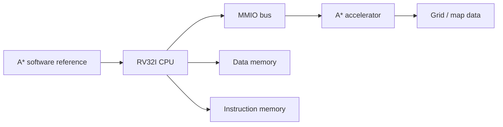

# RV32I A* Accelerator SoC

RV32I 기반 CPU를 직접 설계하고, 이후 MMIO bus와 A* pathfinding accelerator를 붙여 FPGA SoC로 확장하는 프로젝트입니다.

## Project Goal

- Target board: Terasic DE2-115 / Intel Cyclone IV
- HDL: Verilog HDL
- CPU direction: RV32I subset, 5-stage pipeline
- Accelerator direction: A* pathfinding hardware accelerator
- Tool flow: Quartus Prime Lite, Questa FSE, Vivado/XSim for quick sanity checks



## Repository Layout

| Path | Role |
|---|---|
| `Risc_V/` | RV32I CPU implementation and simulation tests |
| `Risc_V/6_23/` | First single-cycle CPU bring-up and basic writeback test |
| `Risc_V/6_24_25/` | Current 5-stage pipeline CPU work, branch flush test, Questa-ready hex/TB |
| `A_star/` | A* algorithm reference code |
| `sw/astar_ref/` | Software-side A* reference implementation for future hardware comparison |
| `PDF/` | Daily reports and portfolio artifacts |

## Current RISC-V Status

Implemented so far:

- Instruction fetch with `imem` and `program.hex`
- Register file with x0 hardwired to zero
- Immediate generator for RV32I formats
- Main control and ALU control
- ALU subset: ADD, SUB, AND, OR, XOR, SLL
- Pipeline registers: IF/ID, ID/EX, EX/MEM, MEM/WB
- Branch target address calculation
- EX-stage branch condition evaluation
- Branch taken flush for IF/ID and ID/EX
- Questa testbench for branch taken/not-taken behavior without RAW hazards

Latest verified test:

```text
PASS: branch taken/not-taken flush test without RAW hazards
```

## Running The Current Questa Test

Place `program.hex` in the same working directory used by Questa, or `cd` to the design folder first.

```tcl
cd D:/Programs/vscode_workspace/Soc_Project/Risc_V/6_24_25
vlib work
vlog -sv *.v
vsim tb_branch_nohazard
run -all
```

Expected result:

```text
PASS: branch taken/not-taken flush test without RAW hazards
```

## Next Milestones

1. Add `LW/SW` data memory verification.
2. Add forwarding and stall logic for RAW/load-use hazards.
3. Extend jump support for JAL/JALR.
4. Prepare MMIO bus interface.
5. Connect A* accelerator prototype to the RV32I system.

## Notes

This project is still in early CPU bring-up. Pipeline hazards, full jump behavior, MMIO integration, and the accelerator datapath are intentionally not complete yet.

