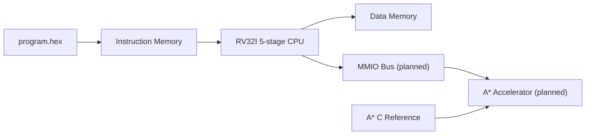

# RV32I A* Accelerator SoC

RV32I 5-stage pipelined RISC-V SoC project targeting the Terasic DE2-115 FPGA board, with a future A* pathfinding accelerator connected through an MMIO-style interface.

## Snapshot

| Area | Status |
|---|---|
| CPU ISA | RV32I subset bring-up |
| Pipeline | 5-stage IF / ID / EX / MEM / WB in progress |
| Verified feature | EX-stage branch decision + IF/ID and ID/EX flush |
| Simulation | Questa FSE branch taken/not-taken test passed |
| Accelerator | A* software reference first, hardware accelerator planned |
| Board | Terasic DE2-115 / Intel Cyclone IV |

## Architecture Direction



## Repository Layout

| Path | Role |
|---|---|
| `Risc_V/6_24_25/` | Current active pipeline CPU implementation |
| `Risc_V/6_23/` | First CPU bring-up and basic register writeback test |
| `Risc_V/Ryu/` | Study/reference RTL collected while learning pipeline structure |
| `A_star/` | A* algorithm reference work |
| `sw/astar_ref/` | Software golden reference for future accelerator comparison |
| `PDF/26_06_25/` | Latest branch flush report in Markdown, DOCX, and PDF |
| `rtl/cpu/`, `tb/cpu/`, `firmware/hex/` | Earlier GitHub-oriented source layout kept from the original repo |
| `docs/` | Earlier devlog/report layout kept from the original repo |

## Current CPU Implementation

The active design is under `Risc_V/6_24_25/`.

Implemented pieces:

- `imem.v`: instruction memory loaded with `$readmemh`
- `reg_file.v`: 32-register file with x0 fixed to zero
- `imm_gen.v`: RV32I immediate generation
- `Control.v`: main control signal decode
- `alu_controller.v`: ALU operation decode
- `alu.v`: arithmetic/logic subset and branch compare
- `PC.v`: next PC selection
- `bta.v`: branch target address calculation
- `IF_ID_reg.v`, `ID_EX_reg.v`, `EX_MEM_reg.v`, `MEM_WB_reg.v`: pipeline registers
- `tb_branch_nohazard.v`: branch flush verification testbench

## Verified Test

The latest Questa test validates:

- BEQ taken flush
- BNE not-taken fall-through
- BLT taken flush
- BGE taken flush

The test intentionally inserts NOPs to avoid RAW hazards because forwarding and stall logic are not implemented yet.

Expected output:

```text
PASS: branch taken/not-taken flush test without RAW hazards
```

Run from Questa Transcript:

```tcl
cd D:/Programs/vscode_workspace/Soc_Project/Risc_V/6_24_25
vlib work
vlog -sv *.v
vsim tb_branch_nohazard
run -all
```

## Reports

Latest portfolio report:

- `PDF/26_06_25/2026-06-25.md`
- `PDF/26_06_25/2026-06-25_RV32I_pipeline_branch_flush.docx`
- `PDF/26_06_25/2026-06-25_RV32I_pipeline_branch_flush.pdf`

## Next Milestones

1. Add `LW/SW` data memory verification.
2. Add forwarding logic for ALU-ALU RAW hazards.
3. Add stall logic for load-use hazards.
4. Complete JAL/JALR datapath behavior.
5. Define MMIO register map for the A* accelerator.
6. Connect the A* accelerator prototype to the RV32I system.

## Project Note

This repository is intentionally incremental. It records the learning path from a basic CPU bring-up toward a pipelined RV32I SoC and, later, an A* accelerator integrated on FPGA.
